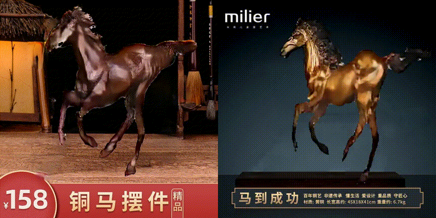

# **Structure-Aware Motion Transfer with Deformable Anchor Model**
Codes for CVPR 2022 paper Structure-Aware Motion Transfer with Deformable Anchor Model.

## **Environments**
The model are trained on 4 Tesla V100 cards, pytorch vesion 1.6 and 1.8 with python 3.6 are tested fine. Basic installations are given in requiremetns.txt.

    pip install -r requirements.txt

## **Datasets**
**TaiChiHD**,**Voxceleb1**,**FashionVideo**,**MGIF**, all following [FOMM](https://github.com/AliaksandrSiarohin/first-order-model). After downloading and pre-processing, the dataset should be placed in the `./data` folder or you can change the parameter `root_dir` in the yaml config file. Note that we save the video dataset with png frames format (for example,`./data/taichi-png/train/video-id/frames-id.png`), for better training IO performance. All train and test video frames are specified in txt files in the `./data` folder.

## **Training**
We train the hdam model in two stages. Firstly we train dam, and detect the abnormal keypoints, the indexes of detected abnormal keypoints are written to the hdam config via the `ignore_kp_list` parameter. We then train hdam model with initialization of dam.

    CUDA_VISIBLE_DEVICES=0,1,2,3 python -m torch.distributed.launch --nproc_per_node=4 run.py --config config/dataset-dam.yaml
    CUDA_VISIBLE_DEVICES=0 python equivariance_detection.py --config config/dataset-dam.yaml --config_hdam config/dataset-hdam.yaml --checkpoint path/to/dam/model.pth
    CUDA_VISIBLE_DEVICES=0,1,2,3 python -m torch.distributed.launch --nproc_per_node=4 run.py --config config/dataset-hdam.yaml --checkpoint path/to/dam/model.pth
 
## **Evaluation**
Evaluate video reconstruction with following command, for more metrics, we recommend to see [FOMM-Pose-Evaluation](https://github.com/AliaksandrSiarohin/pose-evaluation).

    CUDA_VISIBLE_DEVICES=0 python run.py --mode reconstruction --config path/to/config --checkpoint path/to/model.pth  
## **Demo**
To make a demo animation, specify the driving video and source image, the result video will be saved to result.mp4.

    python demo.py --mode demo --config path/to/config --checkpoint path/to/model.pth --driving_video path/to/video.mp4 --source_image path/to/image.png --result_video path/to/result.mp4 --adapt_scale

### E-commerce demo
We make some applications in e-commerce senario, which can be seen in the demo paper [Move as You Like](https://arxiv.org/pdf/2112.13647.pdf)
 

## **Pretrained models**
Coming soon

## **Citation**
    @inproceedings{tao2022structure,
    title={Structure-Aware Motion Transfer with Deformable Anchor Model},
    author={Tao, Jiale and Wang, Biao and Xu, Borun and Ge, Tiezheng and Jiang, Yuning and Li, Wen and Duan, Lixin},
    booktitle={Proceedings of the IEEE/CVF Conference on Computer Vision and Pattern Recognition},
    pages={3637--3646},
    year={2022}
    }
    @inproceedings{xu2021move,
    title={Move As You Like: Image Animation in E-Commerce Scenario},
    author={Xu, Borun and Wang, Biao and Tao, Jiale and Ge, Tiezheng and Jiang, Yuning and Li, Wen and Duan, Lixin},
    booktitle={Proceedings of the 29th ACM International Conference on Multimedia},
    pages={2759--2761},
    year={2021}
    }

## **Acknowledgements**
The implemetation is heavily borrowed from [FOMM](https://github.com/AliaksandrSiarohin/first-order-model), we thank the author for the great efforts in this area.
